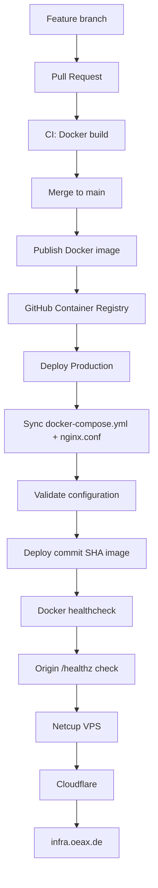

# InfraOpsX

[](https://github.com/infraopsx/infraopsx-site/actions/workflows/ci.yml)
[](https://github.com/infraopsx/infraopsx-site/actions/workflows/publish.yml)
[](https://github.com/infraopsx/infraopsx-site/actions/workflows/deploy.yml)

InfraOpsX is a bilingual infrastructure portfolio and technical website focused on Linux, Docker, Kubernetes, monitoring, storage, networking, and production troubleshooting.

**Website:** https://infra.oeax.de  
**GitHub:** https://github.com/infraopsx/infraopsx-site  
**Container image:** `ghcr.io/infraopsx/infraopsx-site`

---

## Overview

The website is built with Astro and packaged as a Docker image served by Nginx.

The project is also used as a practical CI/CD implementation:

- feature branches for development
- pull requests into `main`
- Docker build validation in CI
- Docker image publishing to GitHub Container Registry
- production deployment to a Netcup VPS
- Docker Compose health checks
- origin `/healthz` verification
- SHA-based production releases
- automatic rollback to the previous image and configuration on deployment failure
- version-controlled production `docker-compose.yml` and `nginx.conf`

---

## Architecture



---

## Technology Stack

- Astro
- Docker
- Docker Compose
- Nginx
- Git
- GitHub Actions
- GitHub Container Registry
- Netcup VPS
- Cloudflare
- Google Search Console
- RSS / Sitemap / multilingual SEO

---

## Repository Structure

```text
.
├── .github/
│   └── workflows/
│       ├── ci.yml
│       ├── publish.yml
│       └── deploy.yml
├── site/
│   ├── public/
│   └── src/
├── Dockerfile
├── docker-compose.yml
├── docker-compose.dev.yml
├── nginx.conf
└── .gitignore
```

### Compose files

`docker-compose.dev.yml`

Used for local development and testing. The image is built locally from the Dockerfile.

`docker-compose.yml`

Used for production. It does not build source code on the VPS and instead runs a versioned image from GHCR:

```text
ghcr.io/infraopsx/infraopsx-site:${IMAGE_TAG:-latest}
```

---

## Local Development

No Node.js or npm installation is required on the host if Docker is available.

Start the development container:

```bash
docker compose -f docker-compose.dev.yml up -d --build
```

Open:

```text
http://localhost:8080
```

Check status:

```bash
docker compose -f docker-compose.dev.yml ps
```

Stop:

```bash
docker compose -f docker-compose.dev.yml down
```

---

## Docker Build

Build directly with Docker:

```bash
docker build -t infraopsx-site:test .
```

Run:

```bash
docker run --rm -p 8080:80 infraopsx-site:test
```

---

## Container Image

The public production image is published to GitHub Container Registry:

```bash
docker pull ghcr.io/infraopsx/infraopsx-site:latest
```

Production releases are also tagged with the first seven characters of the Git commit SHA, for example:

```text
ghcr.io/infraopsx/infraopsx-site:d8f1230
```

This makes deployments traceable and allows deterministic rollback.

---

## CI/CD

### CI

`.github/workflows/ci.yml`

Runs for pull requests targeting `main`.

Purpose:

```text
Pull Request
    ↓
Docker build
    ↓
Pass / Fail
```

No image is published and production is not modified.

### Publish

`.github/workflows/publish.yml`

Runs after changes reach `main`.

It builds and publishes:

```text
ghcr.io/infraopsx/infraopsx-site:latest
ghcr.io/infraopsx/infraopsx-site:<short-sha>
```

### Production Deployment

`.github/workflows/deploy.yml`

Runs only after `Publish Docker Image` succeeds for `main`.

The workflow:

1. checks out the exact deployed Git revision
2. uploads `docker-compose.yml` and `nginx.conf` as temporary files
3. validates the new Docker Compose configuration
4. pulls the exact SHA-tagged image
5. validates the incoming Nginx configuration
6. backs up the active production configuration
7. activates the new configuration
8. deploys the new image
9. waits for the Docker health check
10. checks `/healthz` through the VPS host port
11. rolls back image and configuration if deployment fails

---

## Health Check

Nginx exposes:

```text
/healthz
```

Expected response:

```text
HTTP 200
ok
```

Docker Compose uses the endpoint for container health checks.

Example:

```bash
curl -fsS -H 'Host: infra.oeax.de' http://127.0.0.1/healthz
```

---

## Production Layout

The production VPS keeps only the runtime files:

```text
/opt/compose/infraopsx/
├── .env
├── docker-compose.yml
├── nginx.conf
└── ssl/
    ├── origin.key
    └── origin.pem
```

Version controlled and synchronized by CI/CD:

```text
docker-compose.yml
nginx.conf
```

Kept only on the production VPS:

```text
.env
ssl/
```

Secrets and private keys are never committed to the repository.

---

## Deployment Versioning

Production uses an explicit Git SHA image tag:

```text
IMAGE_TAG=d8f1230
```

The running image can be checked with:

```bash
docker inspect infraopsx --format '{{.Config.Image}}'
```

Container health:

```bash
docker inspect infraopsx --format '{{.State.Health.Status}}'
```

---

## Git Workflow

`main` is the production branch.

Development is done in short-lived branches such as:

```text
feature/*
fix/*
docs/*
chore/*
```

Typical workflow:

```bash
git switch main
git pull --ff-only origin main

git switch -c feature/example-change

# make changes

git add .
git commit -m "feat: describe the change"
git push -u origin feature/example-change
```

Then create a Pull Request into `main`.

Production deployment happens only after the PR is merged and the required workflows succeed.

---

## Security

The repository intentionally excludes:

- TLS private keys
- environment secrets
- API keys
- tokens
- local `.env` files
- production SSL material

Before sharing logs or configuration, remove credentials and sensitive infrastructure identifiers that are not required for troubleshooting.

---

## Content

The site contains:

- infrastructure portfolio
- anonymized production case studies
- Linux / Docker / Kubernetes technical articles
- English and Chinese versions
- RSS feeds
- sitemap and search-engine metadata

Examples:

- Kubernetes Pod Pending troubleshooting
- Kubernetes scheduling failure case study
- InfraOpsX CI/CD project

---

## Contact

For infrastructure, deployment, or troubleshooting inquiries:

**hello@oeax.de**

Website: https://infra.oeax.de
